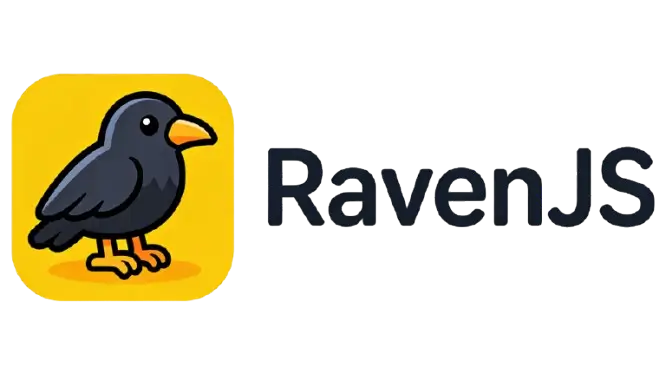

<div align="center">



RavenJS is an **AI-native** Bun web framework. Lightweight and high-performance.

**Primary audience**: AI Agents (e.g. Claude, Cursor Codex).

</div>

## Philosophy

- **Reference code, not a package**: Code lives in your project as reference—AI Agents learn from it and generate similar code. Copy, modify, and use directly; do not import from npm.
- **Skill-first workflow**: AI skills install, configure, learn, and write RavenJS code. The CLI is invoked via skills—not manually.

## Quick Start

Requires **Bun** `>=1.0`. Raven installs in your **project directory**—framework code is copied in as reference for AI agents to learn from.

**0. New project?**

Use [bun init](https://bun.com/docs/runtime/templating/init) first. RavenJS supports **server-only** (`bun init -y`) or [Full Stack Dev Server](https://bun.sh/docs/bundler/fullstack) (`bun init --react`, `bun init --react=tailwind`, etc.).

**1. Install AI skills**

```bash
bunx install-raven
```

**2. Complete setup via Agent**

```
/raven-setup
```

The Agent will install the CLI (if missing), initialize the raven root, install the managed core reference tree, and verify the setup.

**3. Write code via Agent**

```
/raven-use create an HTTP server with /hello
```

## AI Skills

Work with RavenJS primarily through skills.

| Skill            | When to use                                                                                                                                            |
| ---------------- | ------------------------------------------------------------------------------------------------------------------------------------------------------ |
| **raven‑setup**  | Project not yet set up for RavenJS.                                                                                                                    |
| **raven‑use**    | Write application code with RavenJS (routes, handlers, hooks, validation, state). Use when the user wants to build an HTTP server or use RavenJS APIs. |
| **raven‑learn**  | Learn RavenJS core API, architecture, patterns, and official example plugins before writing code.                                                      |
| **raven‑update** | Upgrade the project-local Raven CLI, run `raven sync`, analyze the Git diff, and adapt project code when the update introduces breaking changes.       |

## Core Reference

- RavenJS ships a single managed core reference tree with HTTP services, routing, hooks, state management, and built-in Standard Schema request validation.
- Source docs: [README](packages/core/README.md)

## Example Plugins

- SQL plugin example: see [pattern/runtime-assembly.md](packages/core/pattern/runtime-assembly.md)

## CLI

The CLI is intended for **Agent use**. Skills invoke it via `bunx raven`. For command details, options, and output format see [packages/cli/README.md](packages/cli/README.md). The managed core tree and example assets are installed from the CLI’s embedded source; no network fetch is required.

## Updating

- **Recommended**: trigger the Agent skill:
  ```
  /raven-update
  ```
- **What the skill does**:
  1. Verifies the Git worktree is clean before starting the upgrade
  2. Upgrades `@raven.js/cli` in the current project
  3. Runs `bunx raven sync`, which only requires managed Raven paths to be clean
  4. Analyzes the Git diff and adapts project code if the update contains breaking changes
- **AI skills**: Re-run to overwrite with the latest skill content:
  ```bash
  npx install-raven
  ```

## Development

### Prerequisites

- [Bun](https://bun.sh) `>=1.0` (for development)

### Setup

```bash
bun install
```

### Run CLI locally

```bash
bun run packages/cli/index.ts
```

### Tests

```bash
bun test
bun run test:unit
bun run test:integration
bun run test:e2e
```

### Benchmarks

```bash
bun run benchmark
bun run benchmark:micro
bun run benchmark:e2e
bun run benchmark:compare
```

### Local manifest

Use `--registry` or `RAVEN_DEFAULT_REGISTRY_PATH` so E2E tests use a local embedded-source manifest JSON.

## Release

Push a version tag to trigger the release workflow. The CLI is published to npm as `@raven.js/cli`.

```bash
git tag v1.0.0
git push origin v1.0.0
```

Requires `NPM_TOKEN` in GitHub Secrets.

## License

See repository for license information.
